# PostgreSQL database design

This is the logical 3NF design for ArewaXpressMart. PostgreSQL is the source of truth; Prisma maps these tables without replacing database constraints. All primary keys are `uuid`, timestamps are `timestamptz`, monetary values are `bigint` minor units, and ISO 4217 values use `char(3)` (for example `NGN`).

## Conventions and normalization

- Every business table has `id`, `created_at`, and `updated_at` unless it is immutable event/history data.
- Use lookup tables for reusable states/types that may gain metadata; controlled enums are acceptable for stable technical values (e.g. token type).
- Do not store lists in columns: product categories, roles, permissions, coupon applicability, and order-to-shipment links use junction tables.
- A product has no mutable price column. Selling price is recorded on a `product_variant_price` row and copied to an `order_item` snapshot at checkout.
- Names, addresses, provider responses, and totals are not duplicated when they describe independent entities. Snapshot columns on `order_item`, `order_address`, and `invoice` are intentional historical records, not denormalization errors: they preserve the legal transaction as it existed at purchase time.
- Add `deleted_at` only to user-facing/catalog entities that require soft deletion; financial and audit records are immutable.

## Milestone B bootstrap and integrity

The repeatable seed loads Nigeria (all 36 states plus the Federal Capital Territory and representative development cities), an initial SME category hierarchy, development brands, and internal shipping carriers/methods. It does not provide global geography or real-time carrier pricing. Optional marketplace fixtures require explicit non-production environment variables.

Migration `20260903000000_add_integrity_constraints` adds forward-only PostgreSQL checks for non-negative monetary values, positive quantities, non-negative inventory counters, `reserved <= on_hand`, valid positions, and positive variant weights. Wishlist, coupon, and review constraints are intentionally absent because those models are not present in the current schema.

## Identity, roles, and addresses

| Table | Important columns | Purpose |
|---|---|---|
| `users` | `email` (unique), `password_hash`, `status_id`, `email_verified_at`, `first_name`, `last_name`, `phone_e164` (unique nullable) | Account identity; never stores role names. |
| `user_status` | `code` (unique) | `PENDING_VERIFICATION`, `ACTIVE`, `SUSPENDED`, `DEACTIVATED`. |
| `role` | `code` (unique), `name`, `description` | Application roles such as `CUSTOMER`, `SELLER`, `ADMIN`. |
| `permission` | `code` (unique), `description` | Fine-grained permissions such as `product:moderate`. |
| `user_role` | `user_id`, `role_id`, `assigned_by_user_id`, `assigned_at` | User-to-role junction; composite unique `(user_id, role_id)`. |
| `role_permission` | `role_id`, `permission_id` | Role-to-permission junction; composite unique `(role_id, permission_id)`. |
| `auth_identity` | `user_id`, `provider`, `provider_subject`, `provider_email` | Local/password and external (Google) identity; unique `(provider, provider_subject)`. |
| `refresh_token` | `user_id`, `family_id`, `token_hash` (unique), `expires_at`, `revoked_at`, `replaced_by_token_id` | Hashed rotating refresh tokens. |
| `country` | `iso2` (unique), `name`, `phone_code` | Shared country reference. |
| `state_province` | `country_id`, `code`, `name` | Country subdivision; unique `(country_id, code)`. |
| `city` | `state_province_id`, `name` | City/locality. |
| `address` | `user_id`, `recipient_name`, `phone_e164`, `line1`, `line2`, `city_id`, `postal_code`, `is_default_shipping`, `is_default_billing` | Reusable saved customer/seller address. |

One user may have many identities, refresh tokens, roles, and addresses. A role has many permissions through `role_permission`; a permission can be granted by many roles. `country -> state_province -> city` removes repeated geographic labels from addresses. A `users` row owns an address, but checkout copies it to `order_address` so later edits cannot alter an order.

## Catalog, sellers, inventory, and warehousing

| Table | Important columns | Purpose |
|---|---|---|
| `seller_profile` | `user_id` (unique), `legal_name`, `verification_status_id`, `commission_rate_bps` | Seller extension of a user account. |
| `seller_verification_status` | `code` (unique) | Seller onboarding lifecycle. |
| `store` | `seller_profile_id`, `slug` (unique), `display_name`, `status_id` | A seller may operate one or more storefronts. |
| `store_status` | `code` (unique) | Store approval/publication state. |
| `brand` | `name` (unique), `slug` (unique), `description` | Canonical manufacturer/brand. |
| `category` | `parent_category_id` nullable, `name`, `slug` (unique), `is_active` | Self-referencing category tree. |
| `product` | `store_id`, `brand_id` nullable, `name`, `slug` (unique), `description`, `status_id`, `tax_code` | Seller listing/container, not a purchasable SKU. |
| `product_status` | `code` (unique) | Draft, active, archived, moderated states. |
| `product_category` | `product_id`, `category_id` | Product-to-category junction; unique pair. |
| `product_option` | `product_id`, `name`, `position` | Variant axis, e.g. `Colour`, `Size`. |
| `product_option_value` | `product_option_id`, `value`, `position` | Allowed value on an option. |
| `product_variant` | `product_id`, `sku` (unique), `barcode` nullable unique, `is_active`, `weight_grams` | Purchasable SKU. |
| `product_variant_option_value` | `product_variant_id`, `product_option_value_id` | Variant composition; unique pair. |
| `product_variant_price` | `product_variant_id`, `currency`, `amount_minor`, `starts_at`, `ends_at` nullable | Time-bounded selling price; partial unique index ensures one current price per SKU/currency. |
| `product_image` | `product_id`, `variant_id` nullable, `storage_key` (unique), `alt_text`, `position` | S3 object metadata; optionally specific to a variant. |
| `warehouse` | `store_id`, `address_id`, `code`, `name`, `is_active` | A store's fulfillment location; unique `(store_id, code)`. |
| `inventory` | `warehouse_id`, `product_variant_id`, `on_hand_qty`, `reserved_qty`, `reorder_point`, `version` | Stock balance; unique `(warehouse_id, product_variant_id)`. |
| `inventory_movement` | `inventory_id`, `type_id`, `quantity_delta`, `reference_type`, `reference_id`, `occurred_at` | Immutable stock ledger. |
| `inventory_movement_type` | `code` (unique) | Receive, reserve, release, sale, adjustment, return. |

A seller profile belongs to exactly one user; a seller may operate stores. A store owns products and warehouses. A product belongs to one store, may have one brand, and may appear in multiple categories. Product options produce variants; each variant has one value per option, enforced by database checks/triggers or application plus unique constraints. Inventory belongs to the **variant at one warehouse**, so stock is never ambiguously stored on a product. `inventory_movement` is the audit trail whose references point to an order, return, or manual adjustment.

## Shopping, promotions, and reviews

| Table | Important columns | Purpose |
|---|---|---|
| `cart` | `user_id` nullable, `anonymous_token_hash` nullable unique, `currency`, `expires_at` | Customer or anonymous cart; check enforces exactly one owner form. Anonymous tokens are stored only as hashes and expire. |
| `cart_item` | `cart_id`, `product_variant_id`, `quantity`, `unit_price_minor` | Cart line; unique `(cart_id, product_variant_id)`. |
| `wishlist` | `user_id`, `name`, `is_default` | A named user wishlist. |
| `wishlist_item` | `wishlist_id`, `product_id` | Wishlist-to-product junction; unique pair. |
| `coupon` | `code` (unique), `discount_type_id`, `amount_minor` nullable, `percent_bps` nullable, `currency` nullable, `minimum_order_minor`, `starts_at`, `ends_at`, `max_redemptions`, `per_user_limit`, `is_active` | Promotion definition. |
| `coupon_discount_type` | `code` (unique) | Fixed amount or percentage. |
| `coupon_product` | `coupon_id`, `product_id` | Optional product eligibility junction. |
| `coupon_category` | `coupon_id`, `category_id` | Optional category eligibility junction. |
| `coupon_redemption` | `coupon_id`, `user_id`, `order_id`, `discount_minor`, `redeemed_at` | Immutable successful redemption; unique `(coupon_id, order_id)`. |
| `review` | `user_id`, `product_id`, `order_item_id` nullable unique, `rating`, `title`, `body`, `status_id` | Product feedback; `order_item_id` supports verified purchase. |
| `review_status` | `code` (unique) | Pending, published, rejected. |

One cart has many cart items and a user can retain multiple named wishlists. Cart price is advisory and revalidated at checkout. Coupons use junctions instead of comma-separated eligible IDs. A coupon redemption links the final discount to a completed order and user, enabling limit enforcement. Reviews target products; an optional unique order item proves a specific purchased line can be reviewed only once.

## Orders, fulfillment, returns, refunds, and invoices

| Table | Important columns | Purpose |
|---|---|---|
| `orders` | `order_number` (unique), `user_id`, `status_id`, `currency`, `subtotal_minor`, `discount_minor`, `shipping_minor`, `tax_minor`, `total_minor`, `placed_at` | Customer order header and immutable financial totals. |
| `order_status` | `code` (unique) | Pending payment, paid, processing, completed, cancelled, etc. |
| `order_status_history` | `order_id`, `from_status_id`, `to_status_id`, `changed_by_user_id` nullable, `reason`, `occurred_at` | Immutable order lifecycle audit. |
| `order_address` | `order_id`, `type_id`, `recipient_name`, `phone_e164`, address lines, locality snapshots | Billing/shipping legal snapshot; unique `(order_id, type_id)`. |
| `order_address_type` | `code` (unique) | `SHIPPING`, `BILLING`. |
| `order_item` | `order_id`, `store_id`, `product_variant_id` nullable, SKU/name snapshots, `quantity`, unit/tax/discount/line total fields | Immutable purchased line; variant FK may become null only after catalog retention policy allows it. |
| `shipment` | `order_id`, `warehouse_id`, `shipping_method_id`, `status_id`, `tracking_number`, `shipped_at`, `delivered_at` | A fulfillment parcel; an order can split into many shipments. |
| `shipment_item` | `shipment_id`, `order_item_id`, `quantity` | A shipment-to-order-item junction, supports partial shipments. |
| `shipping_method` | `carrier_id`, `code`, `name`, `service_level`, `is_active` | Carrier service configuration. |
| `shipping_carrier` | `name` (unique), `tracking_url_template` | Carrier reference. |
| `shipping_rate` | `store_id`, `shipping_method_id`, `city_id`, `amount_minor`, `currency`, `is_active` | Configured exact-city price for one store fulfilment group; unique `(store_id, shipping_method_id, city_id)`. |
| `order_shipping_selection` | `order_id`, `store_id`, method/carrier/service-level snapshots, `amount_minor`, `currency` | Immutable per-store customer shipping selection; unique `(order_id, store_id)`. |
| `shipment_status` | `code` (unique) | Pending, packed, shipped, delivered, lost, etc. |
| `shipment_status_history` | `shipment_id`, `status_id`, `occurred_at`, `location`, `details` | Carrier/warehouse tracking events. |
| `payment` | `order_id`, `provider_id`, `provider_reference` (unique), `status_id`, `amount_minor`, `currency`, `idempotency_key`, `authorized_at`, `captured_at` | One attempted provider transaction; unique `(order_id, idempotency_key)`. |
| `payment_provider` | `code` (unique) | Stripe, Paystack, and future gateways. |
| `payment_status` | `code` (unique) | Created, pending, authorized, paid, failed, cancelled, refunded. |
| `payment_webhook_event` | `provider_id`, `provider_event_id`, `payment_id` nullable, `payload`, `received_at`, `processed_at` | Raw verified provider event; unique `(provider_id, provider_event_id)`. |
| `return_request` | `order_id`, `user_id`, `status_id`, `reason_id`, `requested_at`, `approved_at` | Customer request to return one or more lines. |
| `return_item` | `return_request_id`, `order_item_id`, `quantity`, `condition_id`, `resolution_id` | Specific returned quantity; unique pair. |
| `return_status` | `code` (unique) | Requested, approved, received, rejected, closed. |
| `return_reason` | `code` (unique), `description` | Return reason reference. |
| `return_item_condition` | `code` (unique) | Unopened, opened, damaged, etc. |
| `return_resolution` | `code` (unique) | Refund, replacement, store credit. |
| `refund` | `payment_id`, `return_request_id` nullable, `provider_reference` (unique), `status_id`, `amount_minor`, `reason`, `requested_at`, `completed_at` | Provider-backed refund; can be manual/order-level without return. |
| `refund_status` | `code` (unique) | Requested, pending, succeeded, failed, cancelled. |
| `invoice` | `order_id` (unique), `invoice_number` (unique), `status_id`, `issued_at`, `due_at` nullable, totals | Legal/accounting document for an order. |
| `invoice_status` | `code` (unique) | Draft, issued, void, paid. |
| `invoice_item` | `invoice_id`, `order_item_id` nullable, description, quantity, unit/line totals | Immutable invoice line snapshot. |

An order belongs to one user and contains many order items. An item points to the store that must fulfill it; checkout selects one configured city-eligible rate per represented store and sums those immutable selections into `orders.shipping_minor`. A shipment belongs to one order and its `shipment_item` rows determine exactly which portions are in that parcel; new shipping-aware orders link shipments to the selected store shipping method, while legacy orders remain valid. Rates are internal policies, not distance calculations or carrier promises. Shipping-refund policy is deferred.

## Relationship catalogue

Cardinality is written from parent to child. `1:0..1` means an optional one-to-one relationship; `1:N` means one parent can have many child rows. Junction tables implement all many-to-many relationships, keeping the design in 3NF.

| Area | Relationship | Cardinality | Rule / reason |
|---|---|---:|---|
| Access | `user_status -> users` | 1:N | Each user has one status; a status is shared by many users. |
| Access | `users -> user_role <- role` | M:N | A user can hold several roles and a role can be assigned to several users. |
| Access | `role -> role_permission <- permission` | M:N | Permissions are reusable capabilities granted through roles. |
| Access | `users -> auth_identity` | 1:N | A user may connect several sign-in providers; one provider identity belongs to one user. |
| Access | `users -> refresh_token` | 1:N | Each login/session token belongs to one user and is retained for rotation/revocation history. |
| Location | `country -> state_province -> city -> address` | 1:N at each step | Geography is stored once and addresses reference a locality rather than repeating country/state labels. |
| Location | `users -> address` | 1:N | A user may save multiple delivery/billing addresses. |
| Seller | `users -> seller_profile` | 1:0..1 | Seller-only details extend, rather than duplicate, a user account. |
| Seller | `seller_verification_status -> seller_profile` | 1:N | Each seller has one onboarding state. |
| Seller | `seller_profile -> store` | 1:N | A verified seller can operate one or more stores. |
| Seller | `store_status -> store` | 1:N | Each store has one publication/operational state. |
| Catalog | `store -> product` | 1:N | A product listing is owned by one store. |
| Catalog | `brand -> product` | 1:N, optional on product | A product may have no brand; a brand can label many products. |
| Catalog | `product_status -> product` | 1:N | Each product has one lifecycle state. |
| Catalog | `category -> category` | 1:N, optional parent | A category may have one parent and many child categories. |
| Catalog | `product -> product_category <- category` | M:N | Products can appear in several categories and categories contain many products. |
| Catalog | `product -> product_option -> product_option_value` | 1:N at each step | Options such as Size hold their permitted values. |
| Catalog | `product -> product_variant` | 1:N | A product is a listing; a variant is the purchasable SKU. |
| Catalog | `product_variant -> product_variant_option_value <- product_option_value` | M:N | The junction records the selected option values that define a SKU. |
| Catalog | `product_variant -> product_variant_price` | 1:N | Time-ranged rows preserve price history; one current price per SKU/currency is enforced. |
| Catalog | `product -> product_image` and `product_variant -> product_image` | 1:N, variant optional | Images belong to a product and may be associated with a specific variant. |
| Inventory | `store -> warehouse` | 1:N | A store can fulfil from multiple locations. |
| Inventory | `address -> warehouse` | 1:N | A warehouse uses a reusable address record. |
| Inventory | `warehouse -> inventory <- product_variant` | M:N | Each inventory row is the balance for one SKU at one warehouse. |
| Inventory | `inventory -> inventory_movement` | 1:N | The immutable movement ledger explains every stock change. |
| Inventory | `inventory_movement_type -> inventory_movement` | 1:N | Every movement has one controlled reason/type. |
| Shopping | `users -> cart` | 1:N | A signed-in user may retain carts; an anonymous cart is instead identified by a token hash. |
| Shopping | `cart -> cart_item <- product_variant` | M:N | A cart can contain many SKUs; `(cart_id, product_variant_id)` prevents duplicate lines. |
| Shopping | `users -> wishlist -> wishlist_item <- product` | M:N | Users can create named wishlists containing products. |
| Promotions | `coupon_discount_type -> coupon` | 1:N | Each coupon has one calculation method. |
| Promotions | `coupon -> coupon_product <- product` | M:N | Optional product-specific eligibility is normalized into a junction. |
| Promotions | `coupon -> coupon_category <- category` | M:N | Optional category-specific eligibility is normalized into a junction. |
| Promotions | `coupon -> coupon_redemption <- orders` | M:N over time | A redemption records one coupon's discount on one completed order; it also identifies the user. |
| Reviews | `users -> review` and `product -> review` | 1:N | A user writes reviews and a product receives reviews. |
| Reviews | `order_item -> review` | 1:0..1 | An optional, unique order-item link marks a review as a verified purchase. |
| Orders | `users -> orders` | 1:N | Each order is placed by one user. |
| Orders | `order_status -> orders` | 1:N | The current state is normalized; status history records transitions. |
| Orders | `orders -> order_status_history` | 1:N | Lifecycle changes are immutable audit events. |
| Orders | `orders -> order_address` | 1:N (normally two) | Billing and shipping snapshots retain the address used at checkout. |
| Orders | `orders -> order_item` | 1:N | An order header contains its purchased line items. |
| Orders | `store -> order_item` | 1:N | Each line identifies the marketplace store responsible for fulfilment. |
| Orders | `product_variant -> order_item` | 1:N, optional on item | The source SKU is retained when allowed; snapshot fields preserve historical item details. |
| Payment | `orders -> payment` | 1:N | Multiple payment attempts may be made for an order. |
| Payment | `payment_provider -> payment` and `payment_status -> payment` | 1:N each | A payment has one gateway and one state. |
| Payment | `payment -> payment_webhook_event` | 1:N | Provider callbacks are retained for reconciliation and idempotency. |
| Shipping | `orders -> shipment` | 1:N | Orders can be split across parcels and sellers. |
| Shipping | `warehouse -> shipment` and `shipping_method -> shipment` | 1:N each | A shipment leaves one warehouse using one delivery service. |
| Shipping | `shipment -> shipment_item <- order_item` | M:N | The junction supports partial shipment of an order line. |
| Shipping | `shipment -> shipment_status_history` | 1:N | Tracking events form an immutable delivery history. |
| Returns | `orders -> return_request` and `users -> return_request` | 1:N each | A customer requests a return against one of their orders. |
| Returns | `return_request -> return_item <- order_item` | M:N | Return lines identify the exact purchased quantities being returned. |
| Returns | `return_status`, `return_reason`, `return_item_condition`, `return_resolution` | 1:N to their respective return rows | Controlled lookup values prevent repeated, inconsistent workflow text. |
| Refunds | `payment -> refund` | 1:N | A payment may be refunded in several partial amounts. |
| Refunds | `return_request -> refund` | 1:N, optional on refund | A refund may result from a return or be an independent order-level adjustment. |
| Invoicing | `orders -> invoice` | 1:0..1 | One legal invoice may document an order. |
| Invoicing | `invoice -> invoice_item` | 1:N | Invoice lines are immutable accounting snapshots, optionally sourced from order items. |

## ER diagram

```mermaid
erDiagram
  USERS ||--o{ USER_ROLE : receives
  ROLE ||--o{ USER_ROLE : assigned
  ROLE ||--o{ ROLE_PERMISSION : grants
  PERMISSION ||--o{ ROLE_PERMISSION : contains
  USER_STATUS ||--o{ USERS : classifies
  USERS ||--o{ AUTH_IDENTITY : authenticates_as
  USERS ||--o{ REFRESH_TOKEN : owns
  USERS ||--o{ ADDRESS : saves
  COUNTRY ||--o{ STATE_PROVINCE : has
  STATE_PROVINCE ||--o{ CITY : has
  CITY ||--o{ ADDRESS : locates

  USERS ||--o| SELLER_PROFILE : may_be
  SELLER_VERIFICATION_STATUS ||--o{ SELLER_PROFILE : classifies
  SELLER_PROFILE ||--o{ STORE : operates
  STORE_STATUS ||--o{ STORE : classifies
  STORE ||--o{ PRODUCT : lists
  BRAND ||--o{ PRODUCT : brands
  PRODUCT_STATUS ||--o{ PRODUCT : classifies
  CATEGORY ||--o{ CATEGORY : parents
  PRODUCT ||--o{ PRODUCT_CATEGORY : categorized_as
  CATEGORY ||--o{ PRODUCT_CATEGORY : contains
  PRODUCT ||--o{ PRODUCT_OPTION : has
  PRODUCT_OPTION ||--o{ PRODUCT_OPTION_VALUE : permits
  PRODUCT ||--o{ PRODUCT_VARIANT : offers
  PRODUCT_VARIANT ||--o{ PRODUCT_VARIANT_OPTION_VALUE : composed_of
  PRODUCT_OPTION_VALUE ||--o{ PRODUCT_VARIANT_OPTION_VALUE : selected_by
  PRODUCT_VARIANT ||--o{ PRODUCT_VARIANT_PRICE : priced_by
  PRODUCT ||--o{ PRODUCT_IMAGE : displays
  PRODUCT_VARIANT ||--o{ PRODUCT_IMAGE : may_display
  STORE ||--o{ WAREHOUSE : owns
  ADDRESS ||--o{ WAREHOUSE : locates
  WAREHOUSE ||--o{ INVENTORY : stocks
  PRODUCT_VARIANT ||--o{ INVENTORY : counted_in
  INVENTORY ||--o{ INVENTORY_MOVEMENT : records
  INVENTORY_MOVEMENT_TYPE ||--o{ INVENTORY_MOVEMENT : types

  USERS ||--o{ CART : owns
  CART ||--o{ CART_ITEM : contains
  PRODUCT_VARIANT ||--o{ CART_ITEM : selected
  USERS ||--o{ WISHLIST : owns
  WISHLIST ||--o{ WISHLIST_ITEM : contains
  PRODUCT ||--o{ WISHLIST_ITEM : saved
  COUPON_DISCOUNT_TYPE ||--o{ COUPON : types
  COUPON ||--o{ COUPON_PRODUCT : applies_to
  PRODUCT ||--o{ COUPON_PRODUCT : eligible_for
  COUPON ||--o{ COUPON_CATEGORY : applies_to
  CATEGORY ||--o{ COUPON_CATEGORY : eligible_for

  USERS ||--o{ ORDERS : places
  ORDER_STATUS ||--o{ ORDERS : classifies
  ORDERS ||--o{ ORDER_STATUS_HISTORY : changes
  ORDERS ||--o{ ORDER_ADDRESS : snapshots
  ORDERS ||--o{ ORDER_ITEM : contains
  STORE ||--o{ ORDER_ITEM : fulfills
  PRODUCT_VARIANT ||--o{ ORDER_ITEM : source_variant
  ORDERS ||--o{ PAYMENT : has
  PAYMENT_PROVIDER ||--o{ PAYMENT : processes
  PAYMENT_STATUS ||--o{ PAYMENT : classifies
  PAYMENT ||--o{ PAYMENT_WEBHOOK_EVENT : receives
  ORDERS ||--o{ SHIPMENT : ships_in
  WAREHOUSE ||--o{ SHIPMENT : dispatches
  SHIPPING_METHOD ||--o{ SHIPMENT : uses
  SHIPMENT ||--o{ SHIPMENT_ITEM : contains
  ORDER_ITEM ||--o{ SHIPMENT_ITEM : fulfills
  ORDERS ||--o{ COUPON_REDEMPTION : discounts
  COUPON ||--o{ COUPON_REDEMPTION : redeemed
  USERS ||--o{ REVIEW : writes
  PRODUCT ||--o{ REVIEW : receives
  ORDER_ITEM ||--o| REVIEW : verifies
  ORDERS ||--o{ RETURN_REQUEST : may_have
  RETURN_REQUEST ||--o{ RETURN_ITEM : includes
  ORDER_ITEM ||--o{ RETURN_ITEM : returned
  PAYMENT ||--o{ REFUND : refunds
  RETURN_REQUEST ||--o{ REFUND : may_result_in
  ORDERS ||--o| INVOICE : documented_by
  INVOICE ||--o{ INVOICE_ITEM : contains
  ORDER_ITEM ||--o{ INVOICE_ITEM : sources
```

## Integrity, indexes, and implementation notes

- Foreign keys are `RESTRICT` for financial history and `CASCADE` only for pure join rows such as `product_category`; use `SET NULL` for optional historical catalog references.
- Check constraints enforce non-negative quantities/totals, `reserved_qty <= on_hand_qty`, ratings `1..5`, valid coupon amount/percentage shape, `starts_at < ends_at`, and a cart's one-owner rule. Cart and merge availability checks do not reserve inventory; checkout reservation remains separate follow-up work.
- Use partial unique indexes for one default address per user/type and one current variant price per currency. Anonymous cart token hashes use a nullable unique index; expiry uses a schema-compatible `expires_at` index.
- Index all FK columns. Add composite indexes for `product(store_id, status_id)`, `product_category(category_id, product_id)`, `inventory(product_variant_id, warehouse_id)`, `order(user_id, created_at desc)`, `order(status_id, created_at)`, `shipment(tracking_number)`, and `payment(provider_id, provider_reference)`.
- Use transactions with row locking or conditional updates for inventory reservations, coupon redemption limits, payment transitions, and return quantities. The service layer must still perform authorization and workflow validation; constraints protect against concurrent or faulty callers.
- Keep `audit_log` and `outbox_event` as cross-cutting append-only tables: `audit_log(actor_user_id, action, entity_type, entity_id, before_data, after_data, occurred_at)` and `outbox_event(aggregate_type, aggregate_id, event_type, payload, occurred_at, published_at)`.
